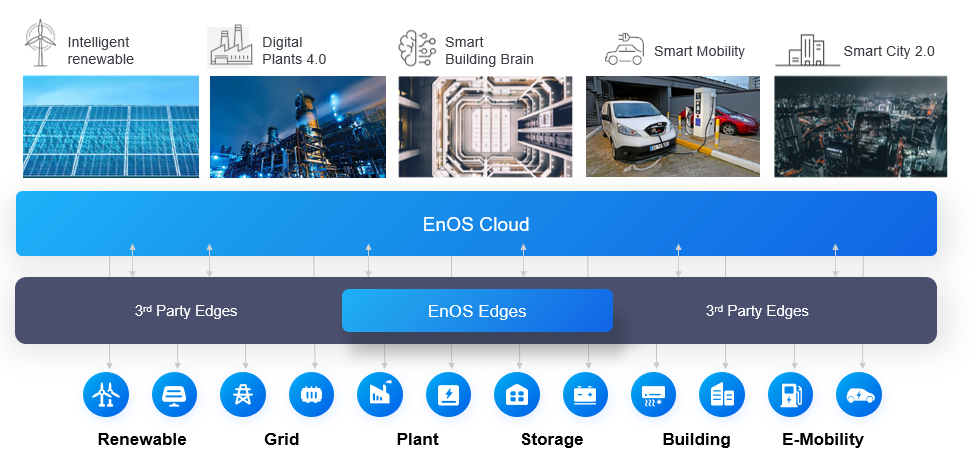

# What is EnOS™?

EnOS™ is the AIoT Operating system from Envision Digital that is missioned to enable enterprise and cities to accelerate digital transformation and ecosystem development. EnOS is built on top of open standards and proven technology to ensure extensive connectivity and ultimate flexibility, accumulates best practices and broad industry knowledge about areas such as renewables, plants, buildings, and cities in its design, and operates in a secure and open eco-system.

## EnOS Advantages

Featured with adaptation, best practices, common services – ABCs, EnOS offers the following advantages:

### Adaptation

- **IaaS Agnostic:** As a PaaS, EnOS is decoupled from the IaaS layer, it can be flexibly deployed on public cloud (AWS, Azure, Google, etc), private cloud, or customer’s private data centers, which enables our clients to leverage proper infrastructure to easily extend their footprint globally according to their needs.

- **Device Connectivity:** The fundamental challenge of an IoT solution is connectivity and implementation efficiency. Designed to tackle the heterogeneity of devices and data, EnOS provides rich library of protocol adapters, device drivers, and built-in digital twin models to help achieve ultimate extensive connectivity and implementation efficiency.

- **System Connectivity:** In addition to device connectivity, EnOS also supports to integrate mainstream IT and OT systems, such as your workorder systems, asset management systems, ERP systems and SCADA systems. The connectivity to vast majority of system help enterprises to break data silos and unleash the synergy power of data.

### Best Practices

- **Domain know-how accumulation:** EnOS accumulates its broad industry knowledge such as predictive maintenance, performance prediction and optimization into machine learning algorithms, provides GUI-based low-code data development experience to help shield the underlying complexity of big data technology, thereby enable enterprises to accelerate data development and monetization. Also, EnOS abstracts the data consumption patterns and calculation scenarios in industries and provide domain-driven data management, development, and governance solutions to help increase the TCO of IoT data.

- **Best-of-the-breed tools**: Base on rich experience of IoT solutions in various of domains, EnOS offers integration of best-of-the-breed tools such as Tableau, Microsoft Power BI, to streamline data analytics and visualization.

### Common Services

EnOS provides end-to-end technical supporting tools and services to help
accelerate application development. With rich APIs, users can access services
and data on EnOS, and quickly assemble digital twin applications with HMI graph editors and report tools. To help complement the dimension of data, EnOS offering common data service to provide data about weather and market. Also, with DevOps and container platform, enterprises can achieve fast development, deployment, iteration, and scaling of application to achieve agile business innnovation.

