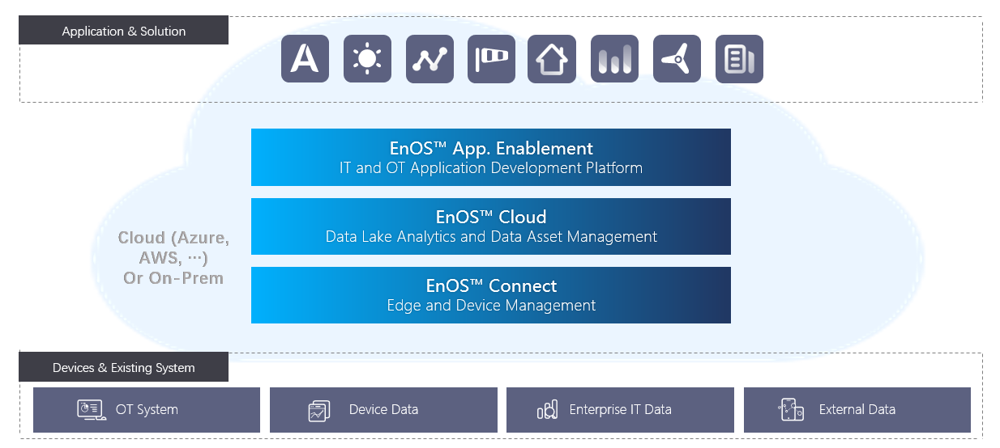

# EnOS Product Architecture

EnOS™ provides comprehensive and modularized offerings to help enterprises and cities to tackle the challenges of digital transformation. 

The following chart illustrates the product architecture of EnOS:

## EnOS Connect

EnOS Connect provides fundamental IoT capabilities such as device connectivity and device management.

### EnOS Edge

EnOS Edge, as the data ingestion frontend of EnOS Cloud, extends connectivity to various devices and 3rd-party systems. In addition, EnOS Edge extends the intelligence of EnOS Cloud to the edge by providing device management, device control, and edge computing through integration and inheritance of traditional OT technologies and deep coordination with EnOS cloud. EnOS Edge can be deployed as the on-site platform where applications can run independently to support edge scenarios that require local management, analytics, and decision-making such as energy, industry and commercial building domains. For more information, see [EnOS Edge](/docs/enos-edge/en/2.0.9/edge_overview.html).

If a 3rd party edge is required, EnOS Cloud also supports 3rd party edges that are compatible with the EnOS device connection framework.

### Device Management

Device Management helps abstract device models and allows connection of heterogeneous of devices in various domains such as industry, smart city, and smart building. By enabling secure and reliable connectivity, EnOS helps to achieve the real-time monitoring of devices and the end-to-end device lifecycle management from the cloud. For more information about the services, see [Device Management](/docs/device-connection/en/2.0.9/device_management_overview).

## EnOS Cloud

EnOS Cloud provides advanced data management and processing capabilities for streaming data ingested real-time from devices as well as offline data integrated from heterogenious of 3-rd party cloud and systems.

### Data Asset Management

Data Asset Management Offering aims to help coap with the challenges of managing huge amount of data resulted from extensive connectivity. With industry knowledge accumulation, the Data Asset Management Services enable enterprises to manage data end-to-end on EnOS securely, effectively, flexibly, while with optimized cost. Through lowering barrier of stream data analytics, optimizing storage schema based on industry scenarios, opening storage policy configurability, and increasing data acquisition efficiency, Data Asset Management Services help reduce your total cost of ownership on data. For more information about the services, see [Data Asset Management](/docs/data-asset/en/2.0.9/data_asset_overview).

### Data Analytics

Data Analytics Services provides large volume of data storage with low-cost and high computing capacity in a distributed architecture to help you integrate and process large volumnes of data at high speed. The services provides tools help you extract, transform, and load data from heterogeneous data sources such as your existing IT and OT systems and quickly obtain insights, explore new business models, and make your business decisions. With robust AI-ready architecture, you can also apply AI/machine learning as you integrate your data into EnOS. For more information about the services, see [Data Analytics](/docs/offline-data/en/2.0.9/datalake_analytics_overview).

## EnOS Application Enablement

The offering provides toolkits, libraries, and services that help your leverage the IoT data and common data services and rapidly build, deploy, and scale applications. By offering a loosely coupled micro-service architecture and encapsulating the underlying IT complexity, lowers barrier of application development and accelerates time to value. For more information about the services, see [Application Enablement](/docs/app-development/en/2.0.9/app_dev_overview).
