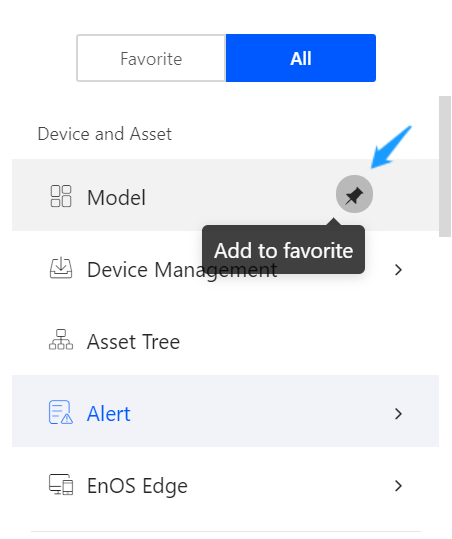
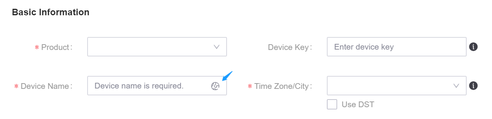
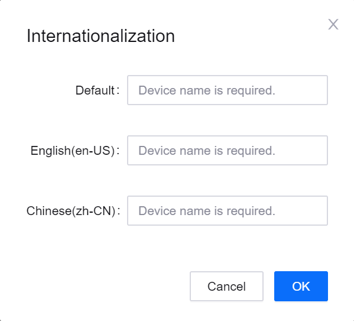

# EnOS Console GUI Conventions

This document describes the common components and interaction behavior of the EnOS™ Console based on a graphical interface.

## Adding Frequently Fsed Service Menus to Favorite

You can access the service menu bar by clicking |menu| in the top left corner from anywhere in the EnOS Console. Depending on your access permissions, the navigation menu will display all the services you are authorized to access, and you can add frequently-used menu items to the **Favorite** according to your operation habits. Conversely, when any service becomes less common, you can also remove it from **Favorites**.

.. |menu| image:: media/menu_icon.png

## Internationalization of Names - *Internationalization Component*

To facilitate the collaboration around EnOS among the users speaking different languages, and ensure that applications can be used by the users speaking different languages, EnOS provides an *internationalization component* for name fields. The following figure shows an example of this component:

### Filling in the Fields

.. |i18n| image:: media/button_i18n.png

- If you do not click |i18n| to fill in the internationalized information, the value in the current input box will become the default value of the name, i.e. the default name will be displayed regardless of the language.

- If you click |i18n| to enter the **Internationalization** prompt:

  

  Here you can input:
  - **Default**: If you do not provide **English (en-US)** and **Chinese (zh-CN)**, this name will be displayed in all languages.
  - **English (en-US)**: This name will be displayed in the English environment.
  - **Chinese (zh-CN)**: This name will be displayed in the Chinese environment.

### Search Behavior Based on Internationalization Component

- If the product name is set respectively in different language environments through the internationalization component, it searches for the corresponding name value in the corresponding language environment, that is, searching for English names in the English environment and Chinese names in the Chinese environment.

- If no corresponding language is set in the internationalization component of the product name, it searches the default value in the internationalization component.

